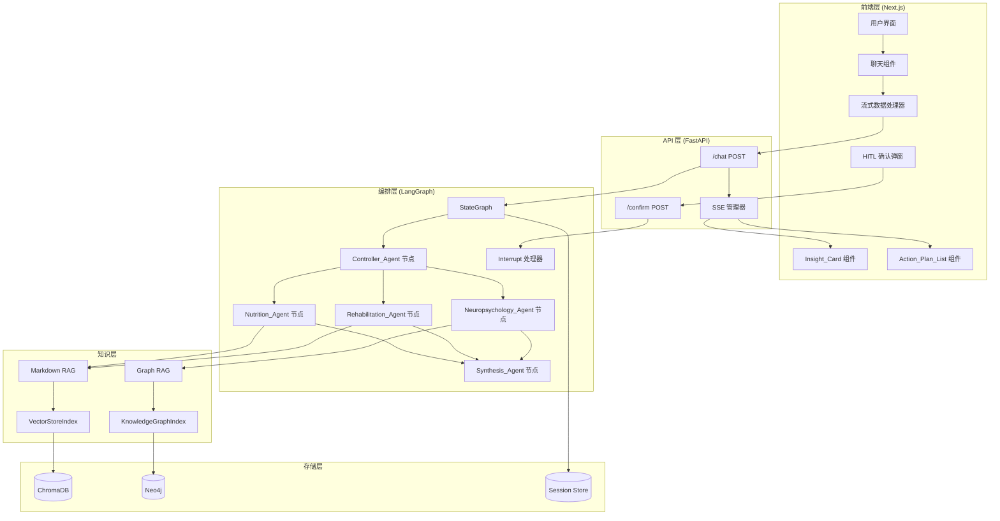
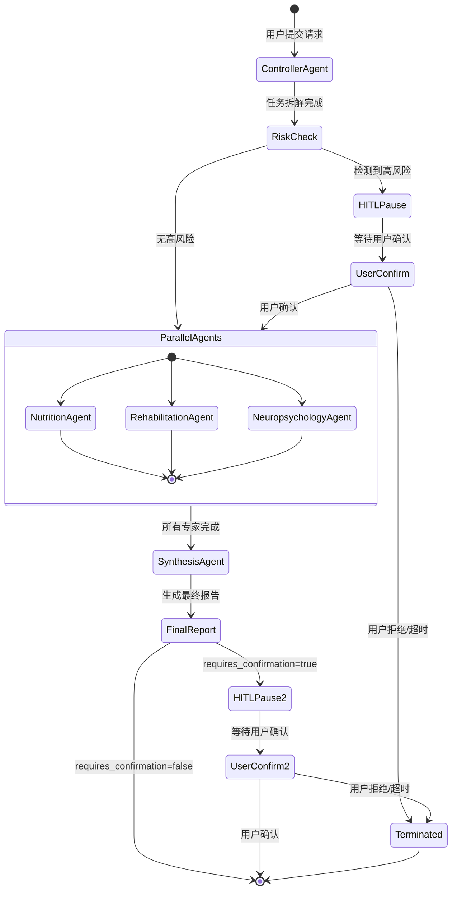
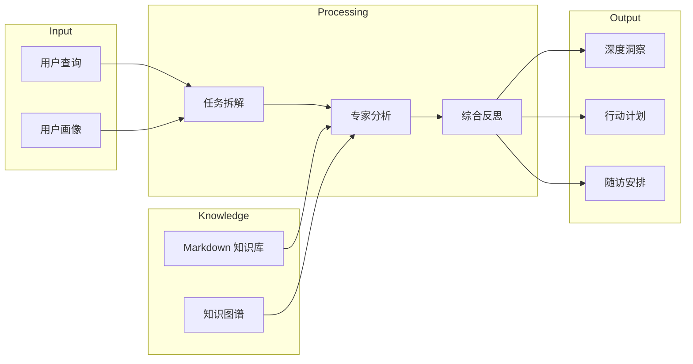
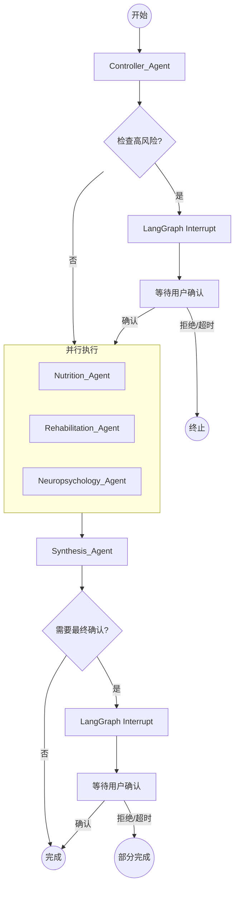

# 技术设计文档

## Overview

个人健康多智能体系统是一个基于 LangGraph 的多智能体编排系统，结合 LlamaIndex 知识检索能力，为用户提供跨学科的健康干预方案。系统采用前后端分离架构，后端使用 Python (FastAPI + LangGraph + LlamaIndex)，前端使用 Next.js + Vercel AI SDK 实现 Generative UI 和流式交互。

### 核心技术栈

| 层级 | 技术选型 |
|------|----------|
| 后端框架 | FastAPI |
| 多智能体编排 | LangGraph |
| 知识检索 | LlamaIndex (MarkdownNodeParser, KnowledgeGraphIndex) |
| 数据验证 | Pydantic v2 |
| 向量存储 | ChromaDB |
| 图数据库 | Neo4j |
| 会话持久化 | SqliteSaver / PostgresSaver |
| 前端框架 | Next.js 14 (App Router) |
| UI 组件库 | shadcn/ui + Tailwind CSS |
| 流式处理 | Vercel AI SDK |

### 设计目标

1. **模块化智能体架构**：每个专家智能体独立封装，支持并行执行
2. **安全的干预控制**：通过 HITL 机制确保高风险干预需用户确认
3. **知识增强推理**：结合 Markdown RAG 和 Graph RAG 提供专业知识支持
4. **实时交互体验**：SSE 流式输出 + Generative UI 组件

---

## Architecture

### 系统架构图



### 多智能体工作流架构



### 数据流图



---

## Components and Interfaces

### 后端组件

#### 1. FastAPI 应用入口 (`app/main.py`)

```python
from fastapi import FastAPI
from fastapi.middleware.cors import CORSMiddleware
from app.api.routes import chat, confirm

app = FastAPI(title="Health Longevity Multi-Agent System")

app.add_middleware(
    CORSMiddleware,
    allow_origins=["*"],
    allow_credentials=True,
    allow_methods=["*"],
    allow_headers=["*"],
)

app.include_router(chat.router, prefix="/api")
app.include_router(confirm.router, prefix="/api")
```

#### 2. 智能体节点接口 (`app/agents/base.py`)

```python
from abc import ABC, abstractmethod
from typing import Any
from app.models.state import HealthState

class BaseAgent(ABC):
    """智能体基类接口"""
    
    @property
    @abstractmethod
    def name(self) -> str:
        """智能体名称"""
        pass
    
    @abstractmethod
    async def process(self, state: HealthState) -> HealthState:
        """处理状态并返回更新后的状态"""
        pass
    
    @abstractmethod
    def get_system_prompt(self) -> str:
        """获取系统提示词"""
        pass
```

#### 3. RAG 工具接口 (`app/tools/rag_interface.py`)

```python
from abc import ABC, abstractmethod
from typing import List, Optional
from pydantic import BaseModel

class RAGResult(BaseModel):
    """RAG 检索结果"""
    content: str
    source: str
    similarity_score: float
    metadata: dict = {}

class RAGInterface(ABC):
    """RAG 工具基类接口"""
    
    @abstractmethod
    async def query(
        self, 
        query_text: str, 
        top_k: int = 5,
        similarity_threshold: float = 0.7
    ) -> List[RAGResult]:
        """执行检索查询"""
        pass
    
    @abstractmethod
    async def health_check(self) -> bool:
        """检查服务健康状态"""
        pass
```

#### 4. SSE 事件管理器接口 (`app/api/sse_manager.py`)

```python
from enum import Enum
from typing import AsyncGenerator, Any
from pydantic import BaseModel

class SSEEventType(str, Enum):
    STATUS = "status"
    INTERMEDIATE = "intermediate"
    REPORT = "report"
    PAUSE = "pause"
    ERROR = "error"
    HEARTBEAT = "heartbeat"

class SSEEvent(BaseModel):
    """SSE 事件数据结构"""
    event_type: SSEEventType
    data: Any
    timestamp: str

class SSEManager:
    """SSE 事件流管理器"""
    
    async def create_stream(
        self, 
        session_id: str
    ) -> AsyncGenerator[str, None]:
        """创建 SSE 事件流"""
        pass
    
    async def emit_event(
        self, 
        session_id: str, 
        event: SSEEvent
    ) -> None:
        """发送 SSE 事件"""
        pass
```

### 前端组件

#### 1. Insight_Card 组件接口

```typescript
// components/insight-card.tsx
interface InsightCardProps {
  deepInsight: string;        // 深度洞察内容 (Markdown 格式)
  isLoading?: boolean;        // 加载状态，默认 false
  className?: string;         // 自定义样式类名
}

export function InsightCard(props: InsightCardProps): JSX.Element;
```

#### 2. Action_Plan_List 组件接口

```typescript
// components/action-plan-list.tsx
interface ActionItem {
  category: "营养" | "康复" | "神经心理";
  title: string;
  description: string;
  frequency: string;
  priority: "高" | "中" | "低";
  risk_level: "高风险" | "中风险" | "低风险";
  duration: string;
}

interface ActionPlanListProps {
  actionPlan: ActionItem[];                    // 行动计划列表
  defaultExpandedCategories?: string[];        // 默认展开的分类
  className?: string;                          // 自定义样式类名
}

export function ActionPlanList(props: ActionPlanListProps): JSX.Element;
```

#### 3. HITL 确认弹窗组件接口

```typescript
// components/hitl-confirmation-dialog.tsx
interface HITLConfirmationDialogProps {
  isOpen: boolean;                             // 弹窗是否打开
  sessionId: string;                           // 会话 ID
  highRiskItems: ActionItem[];                 // 需要确认的高风险干预
  timeoutSeconds: number;                      // 超时秒数 (默认 600)
  onConfirm: () => Promise<void>;              // 确认回调
  onCancel: () => Promise<void>;               // 取消回调
}

export function HITLConfirmationDialog(
  props: HITLConfirmationDialogProps
): JSX.Element;
```

#### 4. 流式数据 Hook 接口

```typescript
// hooks/use-health-chat.ts
interface UseHealthChatOptions {
  onStatusUpdate?: (status: string, agent: string) => void;
  onIntermediate?: (data: any) => void;
  onPause?: (sessionId: string, items: ActionItem[]) => void;
  onError?: (error: Error) => void;
}

interface UseHealthChatReturn {
  messages: Message[];
  isLoading: boolean;
  connectionStatus: "connected" | "disconnected" | "reconnecting";
  currentPhase: string;
  finalReport: FinalReport | null;
  sendMessage: (content: string, userProfileId: string) => Promise<void>;
  confirmHITL: (sessionId: string, confirmed: boolean) => Promise<void>;
  retry: () => Promise<void>;
}

export function useHealthChat(
  options?: UseHealthChatOptions
): UseHealthChatReturn;
```

---

## Data Models

### 核心数据模型 (Pydantic)

#### 1. User_Profile 模型

```python
# app/models/user_profile.py
from datetime import date
from enum import Enum
from typing import List, Optional
from pydantic import BaseModel, Field, field_validator

class Gender(str, Enum):
    MALE = "男"
    FEMALE = "女"
    OTHER = "其他"

class DiseaseStatus(str, Enum):
    CURED = "已治愈"
    TREATING = "治疗中"
    CHRONIC = "慢性管理"

class MedicationFrequency(str, Enum):
    ONCE_DAILY = "每日一次"
    TWICE_DAILY = "每日两次"
    THREE_TIMES_DAILY = "每日三次"
    AS_NEEDED = "按需服用"
    OTHER = "其他"

class ExerciseFrequency(str, Enum):
    NEVER = "从不"
    ONE_TO_TWO = "每周1-2次"
    THREE_TO_FIVE = "每周3-5次"
    DAILY = "每天"

class DietHabit(str, Enum):
    BALANCED = "荤素均衡"
    VEGETARIAN = "素食为主"
    MEAT_BASED = "肉食为主"
    IRREGULAR = "不规律"

class MedicalHistory(BaseModel):
    """既往病史记录"""
    disease_name: str = Field(..., max_length=200)
    diagnosis_date: date
    current_status: DiseaseStatus

class Medication(BaseModel):
    """用药记录"""
    drug_name: str = Field(..., max_length=200)
    dosage: str = Field(..., max_length=100)
    frequency: MedicationFrequency
    start_date: date
    end_date: Optional[date] = None

class BloodLipids(BaseModel):
    """血脂指标"""
    total_cholesterol: float = Field(..., ge=0, le=50, description="总胆固醇 mmol/L")
    triglycerides: float = Field(..., ge=0, le=50, description="甘油三酯 mmol/L")
    hdl: float = Field(..., ge=0, le=50, description="HDL mmol/L")
    ldl: float = Field(..., ge=0, le=50, description="LDL mmol/L")

class BloodGlucose(BaseModel):
    """血糖指标"""
    fasting_glucose: float = Field(..., ge=0, le=50, description="空腹血糖 mmol/L")
    hba1c: float = Field(..., ge=0, le=20, description="糖化血红蛋白 %")

class PhysicalExamination(BaseModel):
    """体检指标"""
    blood_lipids: BloodLipids
    blood_glucose: BloodGlucose

class Lifestyle(BaseModel):
    """生活方式基线"""
    sleep_duration: float = Field(..., ge=0, le=24, description="睡眠时长(小时)")
    exercise_frequency: ExerciseFrequency
    diet_habit: DietHabit
    stress_level: int = Field(..., ge=1, le=10, description="压力水平 1-10")

class UserProfile(BaseModel):
    """用户健康画像"""
    # 基础生理信息
    age: int = Field(..., ge=0, le=150)
    gender: Gender
    height: float = Field(..., ge=30, le=300, description="身高(厘米)")
    weight: float = Field(..., ge=0.5, le=500, description="体重(千克)")
    
    # 既往病史
    medical_history: List[MedicalHistory] = Field(default_factory=list, max_length=100)
    
    # 体检指标
    physical_examination: PhysicalExamination
    
    # 用药史
    medications: List[Medication] = Field(default_factory=list, max_length=50)
    
    # 生活方式基线
    lifestyle: Lifestyle
    
    @property
    def bmi(self) -> float:
        """计算 BMI"""
        height_m = self.height / 100
        return round(self.weight / (height_m ** 2), 2)
```

#### 2. Action_Item 模型

```python
# app/models/action_item.py
from enum import Enum
from pydantic import BaseModel, Field, field_validator
import re

class ActionCategory(str, Enum):
    NUTRITION = "营养"
    REHABILITATION = "康复"
    NEUROPSYCHOLOGY = "神经心理"

class Priority(str, Enum):
    HIGH = "高"
    MEDIUM = "中"
    LOW = "低"

class RiskLevel(str, Enum):
    HIGH = "高风险"
    MEDIUM = "中风险"
    LOW = "低风险"

class ActionItem(BaseModel):
    """干预措施数据结构"""
    category: ActionCategory
    title: str = Field(..., min_length=1, max_length=100)
    description: str = Field(..., min_length=1, max_length=2000)
    frequency: str = Field(..., min_length=1, max_length=200)
    priority: Priority
    risk_level: RiskLevel
    duration: str = Field(..., description="格式: 正整数+时间单位(天/周/月)")
    
    @field_validator("duration")
    @classmethod
    def validate_duration(cls, v: str) -> str:
        pattern = r"^\d+\s*(天|周|月)$"
        if not re.match(pattern, v):
            raise ValueError("duration 格式必须为: 正整数+时间单位(天/周/月)")
        return v
```

#### 3. Final_Report 模型

```python
# app/models/final_report.py
from datetime import datetime
from enum import Enum
from typing import List, Optional
from pydantic import BaseModel, Field

from app.models.action_item import ActionItem

class ConfirmationStatus(str, Enum):
    PENDING = "pending"
    CONFIRMED = "confirmed"
    REJECTED = "rejected"

class FinalReport(BaseModel):
    """最终报告数据结构"""
    deep_insight: str = Field(..., description="底层心身一体病理分析")
    action_plan: List[ActionItem] = Field(
        default_factory=list, 
        max_length=50,
        description="干预措施列表"
    )
    follow_up: str = Field(..., description="随访计划信息")
    requires_confirmation: bool = Field(
        default=False, 
        description="是否需要用户确认高风险干预"
    )
    created_at: datetime = Field(
        default_factory=lambda: datetime.utcnow(),
        description="报告生成时间(UTC)"
    )
    session_id: str = Field(..., description="LangGraph 工作流会话 ID")
    confirmation_status: ConfirmationStatus = Field(
        default=ConfirmationStatus.PENDING
    )
```

#### 4. Health_State 模型 (LangGraph 状态)

```python
# app/models/state.py
from datetime import datetime
from enum import Enum
from typing import Dict, List, Optional, TypedDict
from pydantic import BaseModel, Field

from app.models.user_profile import UserProfile
from app.models.final_report import FinalReport

class TargetAgent(str, Enum):
    NUTRITION = "nutrition"
    REHABILITATION = "rehabilitation"
    NEUROPSYCHOLOGY = "neuropsychology"

class NodeExecutionStatus(str, Enum):
    PENDING = "pending"
    RUNNING = "running"
    COMPLETED = "completed"
    FAILED = "failed"
    SKIPPED = "skipped"

class SubTask(BaseModel):
    """子任务结构"""
    task_id: str
    target_agent: TargetAgent
    task_description: str

class ErrorInfo(BaseModel):
    """错误信息结构"""
    node_name: str
    error_type: str
    error_message: str = Field(..., max_length=1000)
    timestamp: datetime = Field(default_factory=datetime.utcnow)

class HealthState(TypedDict, total=False):
    """LangGraph 全局状态 (兼容 TypedDict)"""
    user_query: str                                          # 用户原始查询 (max 5000字符)
    user_profile: UserProfile                                # 用户健康画像
    task_breakdown: List[SubTask]                            # 子任务列表
    expert_responses: Dict[str, str]                         # 专家响应 {agent_name: response}
    ui_interrupt_flag: bool                                  # 是否需要暂停等待确认
    interrupt_reason: str                                    # 中断原因
    node_execution_status: Dict[str, NodeExecutionStatus]    # 节点执行状态
    error_info: List[ErrorInfo]                              # 错误信息列表
    final_report: Optional[FinalReport]                      # 最终报告
```

### API 请求/响应模型

```python
# app/models/api.py
from typing import List, Optional
from pydantic import BaseModel, Field

from app.models.action_item import ActionItem
from app.models.final_report import FinalReport

# Chat API
class ChatRequest(BaseModel):
    """聊天请求"""
    user_query: str = Field(..., max_length=2000)
    user_profile_id: str

class ChatResponse(BaseModel):
    """聊天响应 (非流式)"""
    session_id: str
    status: str

# Confirm API
class ConfirmRequest(BaseModel):
    """HITL 确认请求"""
    session_id: str
    confirmed: bool

class ConfirmResponse(BaseModel):
    """HITL 确认响应"""
    status: str  # "resumed" | "terminated"
    partial_report: Optional[FinalReport] = None

# SSE Event Data Models
class StatusEventData(BaseModel):
    """状态事件数据"""
    agent_name: str
    progress: str
    percentage: int = Field(ge=0, le=100)

class PauseEventData(BaseModel):
    """暂停事件数据"""
    session_id: str
    high_risk_items: List[ActionItem]
    timeout_seconds: int = 600

class ErrorEventData(BaseModel):
    """错误事件数据"""
    error_type: str
    error_message: str
```

---

## LangGraph 工作流设计

### 工作流状态机图



### LangGraph 工作流实现

```python
# app/workflow/graph.py
from typing import Literal
from langgraph.graph import StateGraph, END
from langgraph.checkpoint.sqlite import SqliteSaver

from app.models.state import HealthState, NodeExecutionStatus
from app.agents.controller import ControllerAgent
from app.agents.nutrition import NutritionAgent
from app.agents.rehabilitation import RehabilitationAgent
from app.agents.neuropsychology import NeuropsychologyAgent
from app.agents.synthesis import SynthesisAgent

# 初始化智能体
controller = ControllerAgent()
nutrition = NutritionAgent()
rehabilitation = RehabilitationAgent()
neuropsychology = NeuropsychologyAgent()
synthesis = SynthesisAgent()

def should_interrupt_after_controller(state: HealthState) -> Literal["interrupt", "parallel"]:
    """判断是否需要在 Controller 后中断"""
    if state.get("ui_interrupt_flag", False):
        return "interrupt"
    return "parallel"

def should_interrupt_after_synthesis(state: HealthState) -> Literal["interrupt", "end"]:
    """判断是否需要在 Synthesis 后中断"""
    final_report = state.get("final_report")
    if final_report and final_report.requires_confirmation:
        return "interrupt"
    return "end"

def create_health_workflow() -> StateGraph:
    """创建健康咨询工作流"""
    
    # 创建状态图
    workflow = StateGraph(HealthState)
    
    # 添加节点
    workflow.add_node("controller", controller.process)
    workflow.add_node("nutrition", nutrition.process)
    workflow.add_node("rehabilitation", rehabilitation.process)
    workflow.add_node("neuropsychology", neuropsychology.process)
    workflow.add_node("synthesis", synthesis.process)
    
    # 设置入口点
    workflow.set_entry_point("controller")
    
    # Controller 之后的条件路由
    workflow.add_conditional_edges(
        "controller",
        should_interrupt_after_controller,
        {
            "interrupt": END,  # 使用 LangGraph interrupt 机制
            "parallel": "nutrition"  # 进入并行执行
        }
    )
    
    # 并行执行配置 (LangGraph 自动处理并行)
    workflow.add_edge("nutrition", "synthesis")
    workflow.add_edge("rehabilitation", "synthesis")
    workflow.add_edge("neuropsychology", "synthesis")
    
    # 从 controller 同时路由到三个并行节点
    workflow.add_conditional_edges(
        "controller",
        lambda s: "parallel" if not s.get("ui_interrupt_flag") else "interrupt",
        {
            "parallel": ["nutrition", "rehabilitation", "neuropsychology"],
            "interrupt": END
        }
    )
    
    # Synthesis 之后的条件路由
    workflow.add_conditional_edges(
        "synthesis",
        should_interrupt_after_synthesis,
        {
            "interrupt": END,
            "end": END
        }
    )
    
    return workflow

def get_compiled_workflow(checkpointer=None):
    """获取编译后的工作流"""
    workflow = create_health_workflow()
    
    if checkpointer is None:
        checkpointer = SqliteSaver.from_conn_string(":memory:")
    
    return workflow.compile(
        checkpointer=checkpointer,
        interrupt_before=["synthesis"],  # 可选：在 synthesis 前中断以检查
        interrupt_after=["controller"]   # 在 controller 后可能中断
    )
```

### HITL Interrupt/Resume 机制

```python
# app/workflow/hitl.py
from typing import Optional
from langgraph.graph import StateGraph
from langgraph.checkpoint.base import BaseCheckpointSaver

from app.models.state import HealthState
from app.models.final_report import ConfirmationStatus

class HITLManager:
    """Human-in-the-Loop 管理器"""
    
    def __init__(self, checkpointer: BaseCheckpointSaver):
        self.checkpointer = checkpointer
        self._paused_sessions: dict = {}
    
    async def pause_workflow(
        self, 
        session_id: str, 
        state: HealthState,
        reason: str
    ) -> None:
        """暂停工作流等待用户确认"""
        self._paused_sessions[session_id] = {
            "state": state,
            "reason": reason,
            "paused_at": datetime.utcnow()
        }
    
    async def resume_workflow(
        self, 
        session_id: str, 
        confirmed: bool
    ) -> Optional[HealthState]:
        """恢复工作流执行"""
        if session_id not in self._paused_sessions:
            return None
        
        session_data = self._paused_sessions.pop(session_id)
        state = session_data["state"]
        
        if confirmed:
            state["ui_interrupt_flag"] = False
            if state.get("final_report"):
                state["final_report"].confirmation_status = ConfirmationStatus.CONFIRMED
            return state
        else:
            if state.get("final_report"):
                state["final_report"].confirmation_status = ConfirmationStatus.REJECTED
            return state
    
    async def check_timeout(self, session_id: str, timeout_minutes: int = 10) -> bool:
        """检查会话是否超时"""
        if session_id not in self._paused_sessions:
            return False
        
        paused_at = self._paused_sessions[session_id]["paused_at"]
        elapsed = (datetime.utcnow() - paused_at).total_seconds() / 60
        return elapsed > timeout_minutes
```

---

## API 设计

### 1. 流式聊天 API

**端点**: `POST /api/chat`

**请求**:
```json
{
  "user_query": "我最近血脂偏高，睡眠质量差，请给我一些建议",
  "user_profile_id": "user_123"
}
```

**响应** (SSE 流):
```
event: status
data: {"agent_name": "Controller_Agent", "progress": "正在分析请求...", "percentage": 10}

event: status
data: {"agent_name": "Controller_Agent", "progress": "任务拆解完成", "percentage": 20}

event: intermediate
data: {"agent_name": "Nutrition_Agent", "partial_result": "检测到血脂异常..."}

event: status
data: {"agent_name": "Nutrition_Agent", "progress": "完成营养分析", "percentage": 40}

event: pause
data: {"session_id": "sess_abc123", "high_risk_items": [...], "timeout_seconds": 600}

event: report
data: {"deep_insight": "...", "action_plan": [...], "follow_up": "...", "requires_confirmation": false}

event: heartbeat
data: {"timestamp": "2024-01-15T10:30:00Z"}
```

### 2. HITL 确认 API

**端点**: `POST /api/confirm`

**请求**:
```json
{
  "session_id": "sess_abc123",
  "confirmed": true
}
```

**响应**:
```json
{
  "status": "resumed",
  "partial_report": null
}
```

**错误响应**:
```json
{
  "status": "error",
  "error_type": "session_not_found",
  "message": "会话不存在或已过期"
}
```

### API 实现代码

```python
# app/api/routes/chat.py
from fastapi import APIRouter, HTTPException
from fastapi.responses import StreamingResponse
from typing import AsyncGenerator
import json
import asyncio

from app.models.api import ChatRequest, StatusEventData, PauseEventData
from app.workflow.graph import get_compiled_workflow
from app.services.user_profile import get_user_profile

router = APIRouter()

async def generate_sse_stream(
    session_id: str,
    user_query: str,
    user_profile_id: str
) -> AsyncGenerator[str, None]:
    """生成 SSE 事件流"""
    
    # 获取用户画像
    user_profile = await get_user_profile(user_profile_id)
    
    # 初始化状态
    initial_state = {
        "user_query": user_query,
        "user_profile": user_profile,
        "task_breakdown": [],
        "expert_responses": {},
        "ui_interrupt_flag": False,
        "interrupt_reason": "",
        "node_execution_status": {},
        "error_info": [],
        "final_report": None
    }
    
    # 获取工作流
    workflow = get_compiled_workflow()
    
    # 执行工作流并流式输出
    config = {"configurable": {"thread_id": session_id}}
    
    async for event in workflow.astream_events(initial_state, config):
        event_type = event.get("event")
        
        if event_type == "on_chain_start":
            node_name = event.get("name", "unknown")
            yield f"event: status\ndata: {json.dumps({'agent_name': node_name, 'progress': '开始处理', 'percentage': 0})}\n\n"
        
        elif event_type == "on_chain_end":
            node_name = event.get("name", "unknown")
            output = event.get("data", {}).get("output", {})
            
            # 检查是否需要 HITL 暂停
            if output.get("ui_interrupt_flag"):
                pause_data = PauseEventData(
                    session_id=session_id,
                    high_risk_items=output.get("high_risk_items", []),
                    timeout_seconds=600
                )
                yield f"event: pause\ndata: {pause_data.model_dump_json()}\n\n"
                return
            
            # 检查是否有最终报告
            if output.get("final_report"):
                yield f"event: report\ndata: {output['final_report'].model_dump_json()}\n\n"
        
        # 心跳
        yield f"event: heartbeat\ndata: {json.dumps({'timestamp': datetime.utcnow().isoformat()})}\n\n"
        await asyncio.sleep(0.1)

@router.post("/chat")
async def chat(request: ChatRequest):
    """流式聊天端点"""
    import uuid
    session_id = str(uuid.uuid4())
    
    return StreamingResponse(
        generate_sse_stream(session_id, request.user_query, request.user_profile_id),
        media_type="text/event-stream",
        headers={
            "Cache-Control": "no-cache",
            "Connection": "keep-alive",
            "X-Session-ID": session_id
        }
    )
```

```python
# app/api/routes/confirm.py
from fastapi import APIRouter, HTTPException
from app.models.api import ConfirmRequest, ConfirmResponse
from app.workflow.hitl import HITLManager

router = APIRouter()
hitl_manager = HITLManager()

@router.post("/confirm", response_model=ConfirmResponse)
async def confirm_hitl(request: ConfirmRequest):
    """HITL 确认端点"""
    
    # 检查会话是否存在且处于暂停状态
    session_status = await hitl_manager.get_session_status(request.session_id)
    
    if session_status is None:
        raise HTTPException(status_code=404, detail={
            "error_type": "session_not_found",
            "message": "会话不存在"
        })
    
    if session_status != "paused":
        raise HTTPException(status_code=400, detail={
            "error_type": "session_not_paused",
            "message": "会话未处于暂停状态"
        })
    
    # 检查超时
    if await hitl_manager.check_timeout(request.session_id, timeout_minutes=10):
        raise HTTPException(status_code=400, detail={
            "error_type": "session_timeout",
            "message": "会话已超时"
        })
    
    # 处理确认/拒绝
    if request.confirmed:
        await hitl_manager.resume_workflow(request.session_id, confirmed=True)
        return ConfirmResponse(status="resumed", partial_report=None)
    else:
        partial_report = await hitl_manager.terminate_workflow(request.session_id)
        return ConfirmResponse(status="terminated", partial_report=partial_report)
```

---

## RAG 工具设计

### Markdown RAG 实现

```python
# app/tools/markdown_rag.py
from typing import List, Optional
from llama_index.core import VectorStoreIndex, Document
from llama_index.core.node_parser import MarkdownNodeParser
from llama_index.vector_stores.chroma import ChromaVectorStore
import chromadb

from app.tools.rag_interface import RAGInterface, RAGResult

class MarkdownRAG(RAGInterface):
    """基于 Markdown 文档的 RAG 检索工具"""
    
    def __init__(
        self,
        collection_name: str,
        chroma_persist_dir: str = "./chroma_db",
        chunk_size: int = 512,
        chunk_overlap: int = 50
    ):
        self.collection_name = collection_name
        self.chunk_size = chunk_size
        self.chunk_overlap = chunk_overlap
        
        # 初始化 ChromaDB
        self.chroma_client = chromadb.PersistentClient(path=chroma_persist_dir)
        self.collection = self.chroma_client.get_or_create_collection(collection_name)
        
        # 初始化向量存储
        self.vector_store = ChromaVectorStore(chroma_collection=self.collection)
        
        # 初始化节点解析器
        self.node_parser = MarkdownNodeParser(
            chunk_size=chunk_size,
            chunk_overlap=chunk_overlap
        )
        
        self.index: Optional[VectorStoreIndex] = None
    
    async def build_index(self, documents: List[Document]) -> None:
        """构建向量索引"""
        nodes = self.node_parser.get_nodes_from_documents(documents)
        self.index = VectorStoreIndex(
            nodes,
            vector_store=self.vector_store
        )
    
    async def query(
        self,
        query_text: str,
        top_k: int = 5,
        similarity_threshold: float = 0.7,
        category: Optional[str] = None  # "营养学" | "运动康复"
    ) -> List[RAGResult]:
        """执行检索查询"""
        if self.index is None:
            return []
        
        # 验证参数范围
        top_k = max(1, min(20, top_k))
        similarity_threshold = max(0.0, min(1.0, similarity_threshold))
        
        # 构建查询引擎
        query_engine = self.index.as_query_engine(
            similarity_top_k=top_k
        )
        
        # 添加类别过滤
        if category:
            query_text = f"[{category}] {query_text}"
        
        # 执行查询
        response = await query_engine.aquery(query_text)
        
        # 转换结果
        results = []
        for node in response.source_nodes:
            if node.score >= similarity_threshold:
                results.append(RAGResult(
                    content=node.text,
                    source=node.metadata.get("source", "unknown"),
                    similarity_score=node.score,
                    metadata=node.metadata
                ))
        
        return results[:top_k]
    
    async def health_check(self) -> bool:
        """检查服务健康状态"""
        try:
            self.chroma_client.heartbeat()
            return True
        except Exception:
            return False
```

### Graph RAG 实现

```python
# app/tools/graph_rag.py
from typing import List, Optional
from llama_index.core import KnowledgeGraphIndex
from llama_index.graph_stores.neo4j import Neo4jGraphStore
import asyncio

from app.tools.rag_interface import RAGInterface, RAGResult

class EntityInfo(BaseModel):
    """实体信息"""
    name: str
    type: str
    properties: dict = {}

class RelationInfo(BaseModel):
    """关系信息"""
    source_entity: str
    target_entity: str
    relation_type: str

class GraphRAGResult(BaseModel):
    """图谱 RAG 结果"""
    entities: List[EntityInfo]
    relations: List[RelationInfo]
    raw_response: str

class GraphRAG(RAGInterface):
    """基于知识图谱的 RAG 检索工具"""
    
    def __init__(
        self,
        neo4j_uri: str,
        neo4j_user: str,
        neo4j_password: str,
        database: str = "neo4j"
    ):
        self.graph_store = Neo4jGraphStore(
            url=neo4j_uri,
            username=neo4j_user,
            password=neo4j_password,
            database=database
        )
        self.index: Optional[KnowledgeGraphIndex] = None
        self.query_timeout = 10  # 秒
    
    async def build_index(self, documents: List[Document]) -> None:
        """构建知识图谱索引"""
        self.index = KnowledgeGraphIndex.from_documents(
            documents,
            graph_store=self.graph_store,
            max_triplets_per_chunk=10
        )
    
    async def query(
        self,
        query_text: str,
        top_k: int = 5,
        similarity_threshold: float = 0.7,
        max_hops: int = 3
    ) -> List[RAGResult]:
        """执行图谱检索查询"""
        if self.index is None:
            return []
        
        # 限制最大跳数
        max_hops = min(3, max(1, max_hops))
        
        try:
            # 设置超时
            query_engine = self.index.as_query_engine(
                include_text=True,
                response_mode="tree_summarize"
            )
            
            # 使用 asyncio.wait_for 实现超时
            response = await asyncio.wait_for(
                query_engine.aquery(query_text),
                timeout=self.query_timeout
            )
            
            # 解析图谱结果
            entities = []
            relations = []
            
            for node in response.source_nodes:
                # 提取实体和关系信息
                if "entity" in node.metadata:
                    entities.append(EntityInfo(
                        name=node.metadata["entity"],
                        type=node.metadata.get("type", "unknown"),
                        properties=node.metadata.get("properties", {})
                    ))
                if "relation" in node.metadata:
                    relations.append(RelationInfo(
                        source_entity=node.metadata.get("source", ""),
                        target_entity=node.metadata.get("target", ""),
                        relation_type=node.metadata["relation"]
                    ))
            
            return [RAGResult(
                content=str(response),
                source="knowledge_graph",
                similarity_score=1.0,
                metadata={
                    "entities": [e.model_dump() for e in entities],
                    "relations": [r.model_dump() for r in relations]
                }
            )]
            
        except asyncio.TimeoutError:
            return [RAGResult(
                content="",
                source="error",
                similarity_score=0.0,
                metadata={
                    "error_type": "timeout",
                    "error_message": f"查询超时 ({self.query_timeout}秒)"
                }
            )]
    
    async def health_check(self) -> bool:
        """检查 Neo4j 连接健康状态"""
        try:
            self.graph_store._driver.verify_connectivity()
            return True
        except Exception:
            return False
```

---

## Error Handling

### 错误分类与处理策略

| 错误类型 | 触发条件 | 处理策略 |
|---------|---------|---------|
| 智能体超时 | 单个智能体执行 > 30秒 | 终止该智能体，记录错误，继续后续流程 |
| RAG 检索失败 | Markdown/Graph RAG 调用失败 | 使用内置基础知识生成通用建议 |
| HITL 超时 | 用户 > 10分钟未响应 | 自动终止会话，释放资源 |
| SSE 连接断开 | 网络中断 | 前端显示重连提示，支持自动重试 |
| 验证错误 | Pydantic 数据验证失败 | 返回详细错误信息，指明违规字段 |

### 错误处理代码

```python
# app/core/exceptions.py
from typing import Optional

class HealthSystemError(Exception):
    """系统基础异常"""
    def __init__(self, message: str, error_type: str, details: Optional[dict] = None):
        self.message = message
        self.error_type = error_type
        self.details = details or {}
        super().__init__(message)

class AgentTimeoutError(HealthSystemError):
    """智能体超时异常"""
    def __init__(self, agent_name: str, timeout_seconds: int):
        super().__init__(
            message=f"智能体 {agent_name} 执行超时 ({timeout_seconds}秒)",
            error_type="agent_timeout",
            details={"agent_name": agent_name, "timeout": timeout_seconds}
        )

class RAGQueryError(HealthSystemError):
    """RAG 检索异常"""
    def __init__(self, rag_type: str, original_error: str):
        super().__init__(
            message=f"{rag_type} 检索失败: {original_error}",
            error_type="rag_query_error",
            details={"rag_type": rag_type, "original_error": original_error}
        )

class SessionNotFoundError(HealthSystemError):
    """会话不存在异常"""
    def __init__(self, session_id: str):
        super().__init__(
            message=f"会话 {session_id} 不存在",
            error_type="session_not_found",
            details={"session_id": session_id}
        )

class SessionTimeoutError(HealthSystemError):
    """会话超时异常"""
    def __init__(self, session_id: str, timeout_minutes: int):
        super().__init__(
            message=f"会话 {session_id} 已超时 ({timeout_minutes}分钟)",
            error_type="session_timeout",
            details={"session_id": session_id, "timeout_minutes": timeout_minutes}
        )
```

```python
# app/core/error_handler.py
from fastapi import Request
from fastapi.responses import JSONResponse
from app.core.exceptions import HealthSystemError

async def health_system_exception_handler(
    request: Request, 
    exc: HealthSystemError
) -> JSONResponse:
    """全局异常处理器"""
    return JSONResponse(
        status_code=400,
        content={
            "error_type": exc.error_type,
            "message": exc.message,
            "details": exc.details
        }
    )
```

---

## Testing Strategy

### 测试类型分布

本系统涉及多种技术组件，测试策略需要区分不同类型：

| 组件类型 | 适用测试方法 | 原因 |
|---------|-------------|------|
| Pydantic 数据模型 | **Property-Based Testing** | 数据验证逻辑是纯函数，输入空间大，适合 PBT |
| RAG 检索工具 | **Integration Testing** | 依赖外部服务 (ChromaDB/Neo4j)，测试服务集成 |
| LangGraph 工作流 | **Integration Testing** + **Mock-Based Unit Testing** | 工作流编排逻辑复杂，需要模拟智能体响应 |
| API 端点 | **Example-Based Testing** + **Integration Testing** | HTTP 接口测试，验证请求/响应格式 |
| 前端组件 | **Snapshot Testing** + **Example-Based Testing** | UI 渲染测试，验证组件行为 |
| SSE 流式输出 | **Integration Testing** | 需要真实的流式连接测试 |

### Property-Based Testing 适用性评估

**适用 PBT 的组件**:
1. **数据模型验证** (Pydantic models) - 验证规则是纯函数，输入空间大
2. **干预措施去重逻辑** - 去重算法是纯函数
3. **BMI 计算** - 数学计算是纯函数

**不适用 PBT 的组件**:
1. **LangGraph 工作流** - 依赖 LLM 响应，非确定性
2. **RAG 检索** - 依赖外部向量/图数据库
3. **SSE 流式输出** - I/O 操作
4. **前端 UI 组件** - 渲染行为

### 测试框架选择

- **Python 后端**: pytest + hypothesis (PBT)
- **前端**: Jest + React Testing Library
- **集成测试**: pytest-asyncio + httpx

---

## Correctness Properties

*A property is a characteristic or behavior that should hold true across all valid executions of a system — essentially, a formal statement about what the system should do. Properties serve as the bridge between human-readable specifications and machine-verifiable correctness guarantees.*

基于 Prework 分析，以下是本系统适合 Property-Based Testing 的正确性属性：

### Property 1: User_Profile 数值范围验证

*For any* 整数年龄值 age，如果 0 ≤ age ≤ 150，则 User_Profile 应成功创建；否则应抛出 ValidationError。

**Validates: Requirements 1.1, 1.7**

### Property 2: User_Profile 身高体重范围验证

*For any* 浮点数 height 和 weight，如果 30 ≤ height ≤ 300 且 0.5 ≤ weight ≤ 500，则 User_Profile 应成功创建；否则应抛出 ValidationError。

**Validates: Requirements 1.1, 1.7**

### Property 3: User_Profile 列表长度约束

*For any* 病史列表 medical_history 和用药列表 medications，如果 len(medical_history) ≤ 100 且 len(medications) ≤ 50，则 User_Profile 应成功创建；否则应抛出 ValidationError。

**Validates: Requirements 1.2, 1.4, 1.7**

### Property 4: User_Profile JSON 序列化往返

*For any* 有效的 User_Profile 对象，将其序列化为 JSON 再反序列化，应得到与原始对象等价的新对象。

**Validates: Requirements 1.6**

### Property 5: Action_Item 枚举值验证

*For any* 字符串 category，如果 category ∈ {"营养", "康复", "神经心理"}，则 Action_Item 应成功创建；否则应抛出 ValidationError。

**Validates: Requirements 2.1, 2.8**

### Property 6: Action_Item 字符串长度约束

*For any* 字符串 title、description、frequency，如果 1 ≤ len(title) ≤ 100 且 1 ≤ len(description) ≤ 2000 且 1 ≤ len(frequency) ≤ 200，则 Action_Item 应成功创建；否则应抛出 ValidationError。

**Validates: Requirements 2.2, 2.3, 2.4, 2.8**

### Property 7: Action_Item duration 格式验证

*For any* 字符串 duration，如果 duration 匹配正则 `^\d+\s*(天|周|月)$`，则 Action_Item 应成功创建；否则应抛出 ValidationError。

**Validates: Requirements 2.7, 2.8**

### Property 8: Action_Item JSON 序列化往返

*For any* 有效的 Action_Item 对象，将其序列化为 JSON 再反序列化，应得到与原始对象等价的新对象。

**Validates: Requirements 2.9**

### Property 9: 高风险关键词检测

*For any* 用户查询文本 user_query，如果 user_query 包含高风险关键词（停药、换药、加药、减药、断食超过24小时、水断食、生酮饮食、极低热量饮食、大剂量补剂），则 ui_interrupt_flag 应设置为 true。

**Validates: Requirements 5.3**

### Property 10: 禁止关键词边界检测

*For any* 用户查询文本 user_query，如果 user_query 包含禁止关键词（自杀、自残、幻觉、幻听、妄想、躁狂发作、重度抑郁、精神分裂、双相情感障碍急性发作），则智能体应返回"建议立即寻求专业精神科医生帮助"并终止处理。

**Validates: Requirements 5.4, 8.7**

### Property 11: 血脂异常检测

*For any* 血脂指标组合 (total_cholesterol, triglycerides, hdl, ldl)，如果 total_cholesterol ≥ 5.2 或 LDL ≥ 3.4 或 HDL < 1.0 或 triglycerides ≥ 1.7，则 Nutrition_Agent 应生成针对性血脂建议。

**Validates: Requirements 6.3**

### Property 12: 血糖异常检测

*For any* 血糖指标组合 (fasting_glucose, hba1c)，如果 fasting_glucose ≥ 6.1 或 hba1c ≥ 5.7，则 Nutrition_Agent 应生成针对性血糖建议。

**Validates: Requirements 6.4**

### Property 13: 药物交互警告触发

*For any* 用药列表 medications，如果 medications 包含华法林、他汀类、二甲双胍、ACEI/ARB类或甲状腺激素类药物，则 Nutrition_Agent 应附加相应的药物-食物交互警告。

**Validates: Requirements 6.5**

### Property 14: 年龄-运动强度匹配

*For any* 年龄 age，Rehabilitation_Agent 应按以下规则匹配运动强度：18-39岁→高强度、40-59岁→中高强度、60-74岁→中等强度、≥75岁→低强度。

**Validates: Requirements 7.2**

### Property 15: BMI 计算与强度调整

*For any* 身高 height 和体重 weight，BMI = weight / (height/100)²。如果 BMI < 18.5 则轻度增强、18.5-23.9 则标准强度、24-27.9 则适度降低、≥28 则显著降低。

**Validates: Requirements 7.3**

### Property 16: 禁忌病史排除运动

*For any* 病史列表 medical_history，如果包含心血管疾病则排除高强度有氧和负重训练，如果包含骨关节疾病则排除高冲击运动和深蹲，以此类推。

**Validates: Requirements 7.6**

### Property 17: 压力等级-干预策略匹配

*For any* 压力等级 stress_level (1-10)，Neuropsychology_Agent 应按以下规则匹配：1-3级→日常调节类、4-6级→结构化训练类、7-10级→专业支持类并标记需关注。

**Validates: Requirements 8.2**

### Property 18: 睡眠时长评估

*For any* 睡眠时长 sleep_duration，如果 < 6 小时则评估为睡眠不足并优先生成睡眠干预、6-9 小时为正常、> 9 小时为睡眠过多。

**Validates: Requirements 8.3**

### Property 19: Action_Item 去重

*For any* Action_Item 列表，如果两个 Action_Item 的 title 相同或 description 语义相似度 > 80%，则去重后只保留一个，按营养>康复>神经心理优先级保留。

**Validates: Requirements 9.3**

### Property 20: 高风险组合检测

*For any* Action_Item 列表和用户画像组合，如果满足以下任一条件则 requires_confirmation 应设置为 true：涉及停药或调整处方药、超过24小时断食方案、心血管病患者高强度运动、超过3种补剂。

**Validates: Requirements 9.5**

### Property 21: 风险等级-随访计划映射

*For any* Final_Report 的风险等级，随访计划应按以下规则生成：高风险→7天后随访、中风险→14天后随访、低风险→30天后随访。

**Validates: Requirements 9.6**

---

## 属性反思与去重

经过反思，以下属性存在冗余或可合并：

1. **Property 1 和 Property 2** 可合并为"User_Profile 数值字段范围验证"
2. **Property 5、Property 6、Property 7** 可合并为"Action_Item 字段验证"
3. **Property 4 和 Property 8** 可合并为"Pydantic 模型 JSON 序列化往返"

合并后的最终属性列表：

| 属性编号 | 属性名称 | 验证需求 |
|---------|---------|---------|
| P1 | User_Profile 数值范围验证 | 1.1, 1.7 |
| P2 | User_Profile 列表长度约束 | 1.2, 1.4, 1.7 |
| P3 | Pydantic 模型 JSON 序列化往返 | 1.6, 2.9 |
| P4 | Action_Item 字段验证 | 2.1-2.8 |
| P5 | 高风险/禁止关键词检测 | 5.3, 5.4, 8.7 |
| P6 | 血脂血糖异常检测 | 6.3, 6.4 |
| P7 | 药物交互警告触发 | 6.5 |
| P8 | 年龄-运动强度匹配 | 7.2 |
| P9 | BMI 计算与强度调整 | 7.3 |
| P10 | 禁忌病史排除运动 | 7.6 |
| P11 | 压力等级-干预策略匹配 | 8.2 |
| P12 | 睡眠时长评估 | 8.3 |
| P13 | Action_Item 去重 | 9.3 |
| P14 | 高风险组合检测 | 9.5 |
| P15 | 风险等级-随访计划映射 | 9.6 |

---

## 完整测试策略

### Property-Based Tests (Hypothesis)

```python
# tests/test_properties.py
from hypothesis import given, strategies as st
from hypothesis import assume
import pytest

from app.models.user_profile import UserProfile, Gender, BloodLipids, BloodGlucose
from app.models.action_item import ActionItem, ActionCategory, Priority, RiskLevel

# Property 1: User_Profile 数值范围验证
@given(
    age=st.integers(),
    height=st.floats(allow_nan=False, allow_infinity=False),
    weight=st.floats(allow_nan=False, allow_infinity=False)
)
def test_user_profile_numeric_range(age, height, weight):
    """验证 User_Profile 数值字段范围约束"""
    valid_age = 0 <= age <= 150
    valid_height = 30 <= height <= 300
    valid_weight = 0.5 <= weight <= 500
    
    if valid_age and valid_height and valid_weight:
        # 应该成功创建 (需要提供其他必填字段)
        pass
    else:
        # 应该抛出 ValidationError
        pass

# Property 3: JSON 序列化往返
@given(st.builds(ActionItem, 
    category=st.sampled_from(ActionCategory),
    title=st.text(min_size=1, max_size=100),
    description=st.text(min_size=1, max_size=2000),
    frequency=st.text(min_size=1, max_size=200),
    priority=st.sampled_from(Priority),
    risk_level=st.sampled_from(RiskLevel),
    duration=st.from_regex(r"^\d{1,3}(天|周|月)$", fullmatch=True)
))
def test_action_item_json_roundtrip(action_item):
    """验证 Action_Item JSON 序列化往返"""
    json_str = action_item.model_dump_json()
    restored = ActionItem.model_validate_json(json_str)
    assert action_item == restored

# Property 6: 血脂血糖异常检测
@given(
    total_cholesterol=st.floats(min_value=0, max_value=50),
    triglycerides=st.floats(min_value=0, max_value=50),
    hdl=st.floats(min_value=0, max_value=50),
    ldl=st.floats(min_value=0, max_value=50),
    fasting_glucose=st.floats(min_value=0, max_value=50),
    hba1c=st.floats(min_value=0, max_value=20)
)
def test_blood_abnormality_detection(
    total_cholesterol, triglycerides, hdl, ldl, fasting_glucose, hba1c
):
    """验证血脂血糖异常检测逻辑"""
    lipid_abnormal = (
        total_cholesterol >= 5.2 or
        ldl >= 3.4 or
        hdl < 1.0 or
        triglycerides >= 1.7
    )
    glucose_abnormal = fasting_glucose >= 6.1 or hba1c >= 5.7
    
    # 验证检测函数返回正确结果
    assert detect_lipid_abnormality(total_cholesterol, triglycerides, hdl, ldl) == lipid_abnormal
    assert detect_glucose_abnormality(fasting_glucose, hba1c) == glucose_abnormal

# Property 8: 年龄-运动强度匹配
@given(age=st.integers(min_value=18, max_value=120))
def test_age_intensity_mapping(age):
    """验证年龄-运动强度匹配"""
    intensity = get_exercise_intensity_by_age(age)
    
    if 18 <= age <= 39:
        assert intensity == "高强度"
    elif 40 <= age <= 59:
        assert intensity == "中高强度"
    elif 60 <= age <= 74:
        assert intensity == "中等强度"
    else:
        assert intensity == "低强度"

# Property 9: BMI 计算与强度调整
@given(
    height=st.floats(min_value=100, max_value=250),
    weight=st.floats(min_value=30, max_value=200)
)
def test_bmi_intensity_adjustment(height, weight):
    """验证 BMI 计算和强度调整"""
    bmi = weight / ((height / 100) ** 2)
    adjustment = get_intensity_adjustment_by_bmi(height, weight)
    
    if bmi < 18.5:
        assert adjustment == "轻度增强"
    elif 18.5 <= bmi < 24:
        assert adjustment == "标准强度"
    elif 24 <= bmi < 28:
        assert adjustment == "适度降低"
    else:
        assert adjustment == "显著降低"
```

### Integration Tests

```python
# tests/integration/test_workflow.py
import pytest
from unittest.mock import AsyncMock, patch

@pytest.mark.asyncio
async def test_workflow_parallel_execution():
    """测试工作流并行执行"""
    # 使用模拟智能体测试并行执行顺序
    pass

@pytest.mark.asyncio
async def test_hitl_interrupt_resume():
    """测试 HITL 中断和恢复"""
    pass

@pytest.mark.asyncio
async def test_sse_stream_events():
    """测试 SSE 事件流"""
    pass
```

### Frontend Tests

```typescript
// __tests__/components/insight-card.test.tsx
import { render, screen } from '@testing-library/react';
import { InsightCard } from '@/components/insight-card';

describe('InsightCard', () => {
  it('renders markdown content correctly', () => {
    render(<InsightCard deepInsight="# 标题\n内容" />);
    expect(screen.getByRole('heading')).toHaveTextContent('标题');
  });

  it('shows skeleton when loading', () => {
    render(<InsightCard deepInsight="" isLoading={true} />);
    expect(screen.getByTestId('skeleton')).toBeInTheDocument();
  });

  it('shows empty state for empty content', () => {
    render(<InsightCard deepInsight="" />);
    expect(screen.getByText('暂无分析内容')).toBeInTheDocument();
  });
});
```

### 测试覆盖目标

| 测试类型 | 覆盖率目标 | 关注点 |
|---------|-----------|--------|
| Property-Based Tests | 15 个核心属性 | 数据验证、业务规则 |
| Unit Tests | 80% 行覆盖 | 工具函数、辅助逻辑 |
| Integration Tests | 关键流程 100% | 工作流、API、RAG |
| E2E Tests | 核心用户旅程 | 完整咨询流程 |

